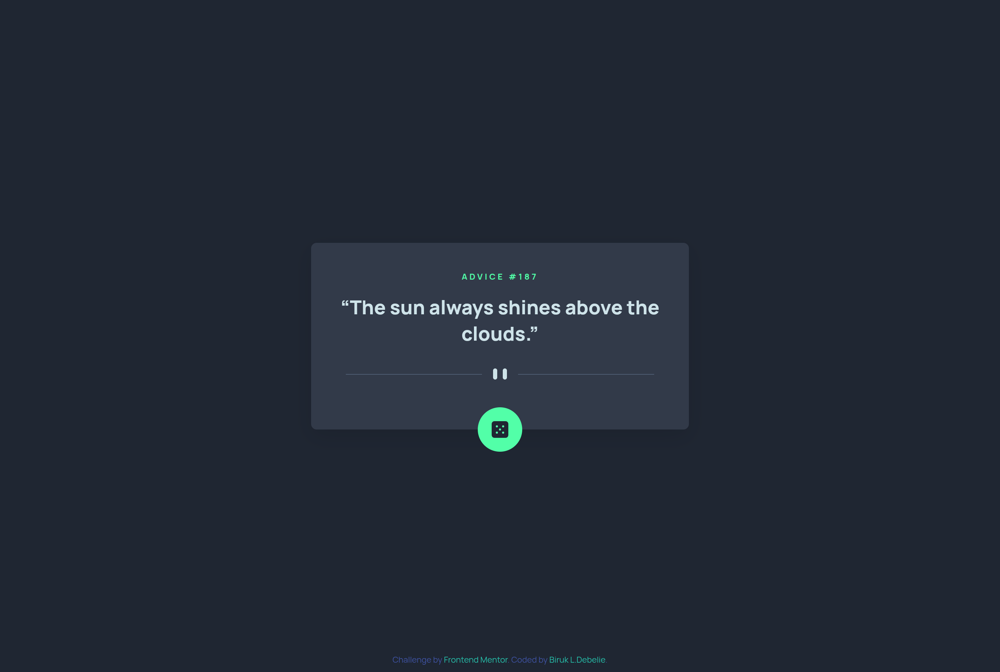

# Frontend Mentor - Advice generator app solution

This is a solution to the [Advice generator app challenge on Frontend Mentor](https://www.frontendmentor.io/challenges/advice-generator-app-QdUG-13db). Frontend Mentor challenges help you improve your coding skills by building realistic projects.

## Table of contents

- [Overview](#overview)
  - [Screenshot](#screenshot)
  - [Links](#links)
- [My process](#my-process)
  - [Built with](#built-with)
  - [What I learned](#what-i-learned)
  - [Continued development](#continued-development)
  - [Useful resources](#useful-resources)
- [Author](#author)
- [Acknowledgments](#acknowledgments)


## Overview

### Screenshot



### Links

- Solution URL: [Frontend Mentor](https://www.frontendmentor.io/solutions/advice-generator-app-vxOxYkDTEA)
- Live Site URL: [Github Pages](https://birukl137.github.io/Advice-generator-app/)

## My process

### Built with

- Semantic **HTML5** markup
- **CSS custom properties** & `clamp()` for responsive sizing
- **Flexbox** and **media queries**
- **`<picture>` element** for responsive images
- **Vanilla JavaScript (ES6+)**
- **Advice Slip API** for random advice
- Accessibility features (`aria-*`, `alt=""`, visually hidden text)

### What I learned

I improved at:
- Using the `<picture>` element to serve different SVGs for mobile/desktop.
- Handling **fetch API** errors gracefully.
- Adding **CSS-driven fade animations** for smoother user experience.
- Keeping styles scalable by using design tokens (`--color-*`, `--space-*`, etc.).

Example: fade animation logic in JS

```js
adviceText.classList.add("fade");
setTimeout(() => {
  adviceText.textContent = `“${slip.advice}”`;
  adviceId.textContent = `#${slip.id}`;
  adviceText.classList.remove("fade");
}, 200);

```

### Continued development
In future projects, I want to:

- Explore a loading spinner/animation instead of plain text.

- Improve API caching (to avoid repeated advice).

- Add a dark/light theme toggle.

- Convert this into a small React component for reusability.

### Useful resources

- [MDN Web Docs - <picture> element](https://developer.mozilla.org/en-US/docs/Web/HTML/Element/picture) - Helped me properly serve responsive SVGs.
- [Advice Slip API](https://api.adviceslip.com/) - Simple API for random advice.
- [CSS Tricks - Using CSS variables](https://css-tricks.com/a-complete-guide-to-custom-properties/) - For organizing design tokens.

## Author

- Frontend Mentor - [@BirukL137](https://www.frontendmentor.io/profile/BirukL137)
- GitHub - [@BirukL137](https://github.com/BirukL137/Advice-generator-app)

## Acknowledgments

Big thanks to Frontend Mentor for the challenge and the community for feedback 🙌
